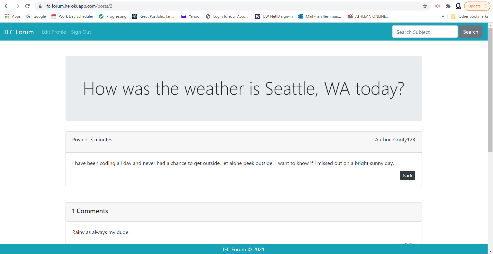

# IFC_Forum
## Description

The IFC forum is a website that allows users to seek answers to questions they may have or are looking to start a conversation thread within a community. I had developed this app using Ruby on Rails along with the Ruby Gem packages devise for user authentication processing, and active storage for the ability to store and upload images. Not only can the user post a question with an optional image, but they can also comment on their own or other’s posts. This was accomplished by nesting the comment resources and paths within the post resources and paths. This app also has a search feature that gives the user the option to search for any existing post title within the app for more efficiency.

For security purposes, I was able to create some restrictions for users and nonusers. Some of these restrictions include updating and deleting comments, which can only be accomplished by the user who created the post/comments while also having to be logged in. Any guest user can view and search posts and comments, but may only be able to create a post or comment if they have an account and are signed in. Displaying a username as the author of a post or comment is another feature that provides a bit more security for the user while also providing identification to other users. This app was deployed through Heroku.
.      

## Table of Contents

* [License](#license)
* [Contributing](#contributing)
* [Screenshot](#screenshot)
* [Link](#link)
* [Questions](#questions)

## License

MIT

## Contributing

Ianaac27

# Screenshot

Here is a mock of the IFC Forum.

# Link

Take a look at the live version through Heroku [here.](https://ifc-forum.herokuapp.com/)
